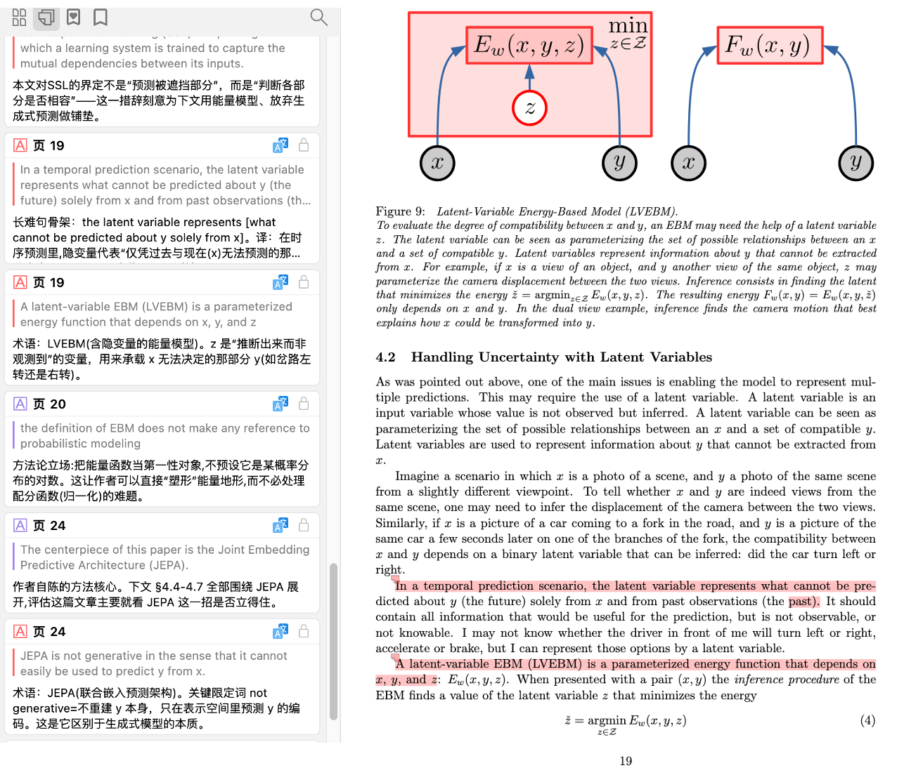

<div align="center">
  <h2>🧭 ZotPilot</h2>
  

  <p>
    <a href="https://www.zotero.org/">
      
    </a>
    <a href="https://claude.ai/code">
      
    </a>
    <a href="https://github.com/openai/codex">
      
    </a>
    <a href="https://opencode.ai/">
      
    </a>
    <a href="https://modelcontextprotocol.io/">
      
    </a>
    <a href="https://pypi.org/project/zotpilot/">
      
    </a>
  </p>
  <p>
    
    
  </p>

  <p><b>让 AI 读懂你的 Zotero 文献库，论文数据不离家。</b></p>

  <p>
    <a href="#快速开始">快速开始</a> &bull;
    <a href="#能做什么">能做什么</a> &bull;
    <a href="#使用模式与示例">使用模式与示例</a> &bull;
    <a href="#工作原理">工作原理</a> &bull;
    <a href="#更新">更新</a> &bull;
    <a href="#faq">FAQ</a> &bull;
    <a href="README_EN.md">English</a>
  </p>
</div>

---

## v0.5.1 — 单篇精读 · 更自由的嵌入 · 更稳的索引

这个版本有三条主线。

**`/ztp-tutor` 单篇精读**：让 AI 通读库里一篇论文，把长难句翻译、术语解释、方法论点评等**逐句批注**，连同五维彩色高亮、图表标注**直接写进 Zotero 的 PDF**——在阅读器里原地对照看，等于多了一位帮你拆解全文的导读老师，全程本地。批注语言 / 深度随你的阅读画像（无画像先征询），写前自动备份。

<div align="center">
  
  <br><sub>高亮与逐句批注直接写进 Zotero 的 PDF，阅读器里原地查看</sub>
</div>

**更自由的嵌入**：新增通用 OpenAI 兼容嵌入 provider，并内置 SiliconFlow、智谱 GLM、Ollama 等模型配置，也可填任意端点自定义模型与维度。

**更稳更准的索引**：限流自动重试、跨进程加锁、从源头修了一类中文 PDF 抽取乱码（pymupdf4llm 内部 OCR 误判）、vision 结果缓存避免重复付费，并新增 `doctor --recover-index` 零额度重建索引。

---

## v0.5.0 — 调研工作流

这个版本的核心变化：agent 现在能真正帮你收集论文，而不只是搜索已有的库。

新增的 **Connector 浏览器扩展**让 agent 通过你自己的 Chrome 会话保存论文。好处是实际的：机构订阅的 PDF 也能一起拿到。你挂着学校 VPN 或者在校园网，把一批 DOI 或 arXiv 号交给 agent，它帮你全部存进 Zotero，连带 PDF，不用一篇一篇手动操作。

完整的调研工作流用 `/ztp-research` 触发：OpenAlex 搜索候选 → 确认名单 → Connector 入库 → 自动打标签、分集合 → 逐篇报告，全程由 agent 推进。

这个版本还重构精简了 MCP 工具集（三层架构，废弃别名保留到 v0.6.0），修了一批边界 bug，并加固了增量索引，让它在中断后能从断点正确恢复。

---

## 快速开始

```bash
pip install zotpilot
zotpilot setup                 # 交互式配置 + 自动部署 skills + 注册 MCP
# 重启你的 AI 客户端
```

然后跟 agent 说「搜我库里关于 X 的论文」或「帮我调研 Y 方向」。它会按流程把 20 个 MCP 工具和 5 个 packaged skill 串起来完成任务。

**前置**：[Zotero 8](https://www.zotero.org/download/)（已安装并至少启动过一次）· Python 3.10+ · 支持的 AI Agent 客户端（Claude Code / Codex / OpenCode）。入库工作流还需要 [Connector 浏览器扩展](#安装详情)。

ZotPilot 会把 Codex packaged skills 部署到 `~/.agents/skills`。旧的 `$CODEX_HOME/skills`（默认通常是 `~/.codex/skills`）只是 Codex 兼容路径；如果你的 Codex 桌面环境显示该路径，它不是 ZotPilot 的部署目标。

---

## 能做什么

ZotPilot 由三部分组成：

| 组件 | 作用 |
|------|------|
| **MCP Server** | 约 20 个原子工具：语义搜索、引用图谱、入库、精读批注、标签 / 集合 / 笔记管理 |
| **Connector** | Chrome 扩展。agent 通过你的浏览器会话保存论文，保留机构订阅 PDF |
| **Agent Skills** | 把工具串成完整研究流程，不只是单次调用 |

### 5 个 skill 覆盖研究流程

| Skill | 做什么 |
|-------|--------|
| `ztp-research` | 本地库 + OpenAlex 检索 → 候选确认 → Connector 入库 → 自动打标签 / 分集合 → 逐篇报告 |
| `ztp-review` | 基于库内论文做综述、聚类、比较、初稿整理 |
| `ztp-tutor` | 单篇精读：五维彩色高亮 + 逐句批注 + 图表标注，直接写进 Zotero 的 PDF（批注语言 / 深度随阅读画像，无画像时先征询）；写前自动备份，可回滚 |
| `ztp-profile` | 分析文献库主题分布、期刊层次、时间跨度、标签使用 |
| `ztp-setup` | 指导 agent 调用 `zotpilot setup` / `upgrade` / `doctor` 做安装、更新、排错（它不是 CLI 命令本身）|

### 5 个核心能力

| 能力 | 不一样在哪 |
|------|--------|
| **语义搜索** | 按意思搜，不只关键词匹配。结果精确到章节段落 |
| **一步入库** | DOI / arXiv / URL 混合输入 → Connector 浏览器保存 → 验证 → 必要时回退 |
| **引用图谱** | OpenAlex 查引用链，并在引用论文里搜特定观点 |
| **批量整理** | 语义匹配 → 打标签、分集合、写笔记，同步回 Zotero |
| **学术检索** | OpenAlex 全参数检索，可直接喂给入库流程 |

---

## 和其他方案的区别

| | 语义搜索 | 章节定位 | 入库 + 整理 | 引用图谱 | 安装 |
|------|:-:|:-:|:-:|:-:|--------|
| Zotero 原生 | ✗ | ✗ | ✗ | ✗ | — |
| 把 PDF 喂给 AI | ✓ | ✗ | ✗ | ✗ | 手动 |
| 自己搭 RAG | ✓ | 看实现 | ✗ | ✗ | 数小时 |
| [zotero-mcp](https://github.com/54yyyu/zotero-mcp) | ✓ | ✗ | 部分 | ✗ | ~5 min |
| **ZotPilot** | ✓ | ✓ | ✓（Connector） | ✓ | ~5 min |

不一样的地方主要在于：入库走真实浏览器会话和 Zotero translator，机构订阅的 PDF 也能一起拿到；引用数据来自 OpenAlex；排序和重排细节放在下面的工作原理里。

---

## 安装详情

<details>
<summary><b>嵌入模型选择</b></summary>

`zotpilot setup` 两层选择：先选**厂商**，再选**模型**（推荐项已预选，回车即用）。云端、本地、自建端点共享同一套运行时，可按成本 / 隐私 / 网络自由切换。`siliconflow` / `zhipu` / `ollama` / `custom` 都走通用 `openai-compatible` 路径，区别只在 `base_url`。

| 厂商（别名） | 运行时 provider | 推荐模型 · 维度 | base_url | 需 Key |
|---|---|---|---|:---:|
| `google`（`gemini`） | gemini | `gemini-embedding-001` · 768 | — | ✓ |
| `dashscope` | dashscope | `text-embedding-v4` · 1024 | — | ✓ |
| `local` | local | `all-MiniLM-L6-v2` · 384 | — | ✗ |
| `siliconflow` | openai-compatible | `BAAI/bge-m3` · 1024 | `…siliconflow.cn/v1` | ✓ |
| `zhipu` | openai-compatible | `embedding-3` · 2048 | `…bigmodel.cn/api/paas/v4` | ✓ |
| `ollama` | openai-compatible | `nomic-embed-text` · 768 | `localhost:11434/v1` | ✗ |
| `custom` | openai-compatible | 自填 model + 维度 | 自填 | 视端点 |

- **SiliconFlow** 另可选 `Qwen/Qwen3-Embedding-0.6B`（1024）、`Qwen/Qwen3-Embedding-8B`（2048）。
- **DashScope** 默认走 OpenAI 兼容 endpoint；如需原生 document / query 非对称检索语义，可 `zotpilot config set dashscope_embedding_endpoint native` 后 `zotpilot index --force` 重建。
- **`custom`** 接任意 OpenAI 兼容端点（vLLM、其它云、自建）：填根地址（通常以 `/v1` 结尾，GLM 例外是 `/api/paas/v4`）、模型 id、维度即可；本地端点可省 Key。
- **`local`** 模型在首次实际嵌入时才下载，不在 `setup` 阶段预下载。

非交互式（agent 友好，省略 `--embedding-model` 取推荐项；固定 base 的厂商自动带上 base_url 与维度）：

```bash
zotpilot setup --list-vendors [--json]                         # 列出全部厂商/模型
zotpilot setup --non-interactive --provider gemini             # 或 dashscope / local
zotpilot setup --non-interactive --provider siliconflow --embedding-key <key> --verify
zotpilot setup --non-interactive --provider custom \
  --embedding-base-url http://localhost:11434/v1 \
  --embedding-model nomic-embed-text --embedding-dimensions 768
# 兼容旧脚本：--provider gemini|dashscope|local|openai-compatible 仍作为别名有效
```

> **换模型需重建**：不同模型维度不同，切换 provider / model / dimensions 后要 `zotpilot index --force` 重建（旧向量在重建前保留，不会静默删除）。维度无需手动猜——`setup` 写入后会真实嵌入自检，入库时再做维度断言，对不上立刻报错并提示应填的维度，绝不静默污染索引；加 `--verify` 会打印一行 JSON（`ok` / `dim_mismatch` / `auth` / `unreachable`）便于 agent 自愈。

</details>

<details>
<summary><b>公式 OCR（可选）</b></summary>

公式索引是可选能力，默认不启用。需要本地公式 OCR 时安装 extra：

```bash
pip install "zotpilot[formula]"
# 开发安装：
pip install -e ".[formula,dev]"
```

然后启用配置并重新索引：

```bash
zotpilot config set formula_ocr_enabled true
zotpilot index
```

当前阶段只面向**有文字层 PDF 中的 display formulas**：ZotPilot 会在本地识别候选公式块、写入公式 chunk，并和正文 / 表格 / 图表一起参与语义检索。默认 `local` provider 全程在本机运行，不会把公式图片或 LaTeX 发送到外部服务；首次使用会联网下载 RapidLaTeXOCR 模型权重（约数十 MB），之后可离线运行。

如果你愿意使用云端公式识别，也可以显式切换到 SimpleTex provider。它会把公式裁剪图发送到配置的 SimpleTex HTTPS endpoint，因此只建议在你接受该数据外发边界时启用：

```bash
zotpilot config set formula_ocr_provider simpletex
zotpilot config set formula_ocr_simpletex_token <your-uat-token>
# 或使用 APP 鉴权：
zotpilot config set formula_ocr_simpletex_app_id <your-app-id>
zotpilot config set formula_ocr_simpletex_app_secret <your-app-secret>
```

默认 endpoint 是标准版 `https://server.simpletex.net/api/latex_ocr`，并按标准版限流预设 `formula_ocr_simpletex_min_interval=0.55` 与 `formula_ocr_simpletex_max_retries=2`；如需更快的轻量版，可设置 `formula_ocr_simpletex_endpoint` 为 `https://server.simpletex.net/api/latex_ocr_turbo`，并按你的配额调整最小请求间隔。inline math、纯图片 / 矢量公式和整页 fallback 仍留到后续阶段。

</details>

<details>
<summary><b>API Key 与环境变量</b></summary>

配置模型分两层：

- `zotpilot setup` 写共享本地配置到 macOS / Linux 的 `~/.config/zotpilot/config.json`，或 Windows 的 `%APPDATA%\zotpilot\config.json`，并自动部署 skills / 注册 MCP
- `zotpilot config set` 管理共享配置；API key 也会写入同一个 `config.json`
- `zotpilot upgrade` 升级 CLI，并刷新 packaged skills / 同步 MCP runtime
- API key 不写入 Claude / Codex / OpenCode 的客户端配置

环境变量仍可作为临时 override，优先级高于 `config.json`：

```bash
export GEMINI_API_KEY=<your-key>           # 或 DASHSCOPE_API_KEY
export ANTHROPIC_API_KEY=<your-key>        # 可选：复杂表格视觉提取
export GEMINI_BASE_URL=<https-proxy>       # 可选：Gemini 自定义端点（代理/受限地区）
```

> `GEMINI_BASE_URL` 必须是 `https://`，且你的 `GEMINI_API_KEY` 会被发送到该端点——只指向你信任的 HTTPS 代理。留空则用官方端点。

`config.json` 可能包含 API key。不要提交、公开粘贴或同步到不可信位置；共享机器上优先用交互式 `zotpilot setup` 输入密钥，避免把 key 留在 shell history。

推荐顺序：

```bash
zotpilot setup                         # 交互式：会询问 embedding key 以及 Zotero User ID / API key（可跳过）
# 或
zotpilot setup --non-interactive --provider gemini
```

之后如果需要修改配置：

```bash
zotpilot config set gemini_api_key <key>
zotpilot config set zotero_user_id <id>
zotpilot config set zotero_api_key <key>
zotpilot setup
```

可选：`openalex_email` 不是密钥，只是 OpenAlex 联系邮箱。配置后 OpenAlex 相关搜索 / 引文查询能走 polite pool（约 10 req/s；未配置通常约 1 req/s）：

```bash
zotpilot config set openalex_email you@example.com
```

</details>

<details>
<summary><b>Connector 浏览器扩展</b></summary>

入库工作流默认只说明 Chrome：

1. 打开 [最新 Release](https://github.com/xunhe730/ZotPilot/releases/latest)，下载 `zotpilot-connector-v*.zip` 并解压
2. Chrome 地址栏打开 `chrome://extensions/`
3. 打开右上角**开发者模式**
4. 点击**加载已解压的扩展程序**
5. 选择包含 `manifest.json` 的目录
6. 工具栏出现 Zotero 图标即安装成功

> ZotPilot Connector 是官方 Zotero Connector 的 fork。两者可共存：官方扩展处理手动保存，ZotPilot Connector 处理 agent 调用。

Connector 升级：

1. 重新下载最新 Release zip
2. 打开 `chrome://extensions/`
3. 在已加载的 ZotPilot Connector 上点刷新

</details>

<details>
<summary><b>启用写操作（标签 / 集合 / 笔记）</b></summary>

搜索和引用无需额外凭据。写操作需要 Zotero Web API 密钥：

1. 打开 [zotero.org/settings/keys](https://www.zotero.org/settings/keys)
2. 记下页面顶部的**数字 User ID**
3. 创建 private key，勾选 "Allow library access" + "Allow write access"

```bash
zotpilot config set zotero_user_id 12345678
zotpilot config set zotero_api_key YOUR_KEY
zotpilot setup
zotpilot doctor
```

迁移旧的客户端内嵌 secret：

```bash
zotpilot config migrate-secrets
```

</details>

<details>
<summary><b>验证安装</b></summary>

```bash
zotpilot doctor     # 诊断配置 / 环境 / MCP 注册
zotpilot status     # 索引状态
```

MCP 工具或 Skill 没出现？重新运行 `zotpilot setup` 并重启 agent。高级用户如果只想刷新 agent 集成，可用 `zotpilot install`。

</details>

---

## 使用模式与示例

### 直接自然语言交互

适合简单、单步、目标清晰的任务，直接对 agent 说即可：

- “搜我库里关于 X 的论文”
- “哪些论文的 Results 里提到 Y？”
- “谁引用了这篇？”
- “索引了多少论文？”

这类请求通常会直接调用单个或少量 MCP 工具完成。

常见例子：

| 你说 | agent 做 |
|------|---------|
| 「搜我的论文，关于 X」 | 语义搜索已索引论文 |
| 「哪些论文的 Results 里提到 Y？」 | 按章节 + 关键词定位段落 |
| 「找比较模型准确率的表格」 | 搜 PDF 提取的表格内容 |
| 「谁引用了这篇？怎么评价？」 | OpenAlex 查引用 → 搜观点段落 |
| 「索引了多少论文？」 | 索引状态检查 |

### `ztp-*` workflow

适合多阶段、容易跑偏、需要 agent 按顺序推进的任务，建议显式触发 workflow：

- `ztp-research`
  - “/ztp-research 帮我调研 X 方向最近的重要论文，并把值得收的入到 Zotero 里”
- `ztp-review`
  - “/ztp-review 基于我库里的论文整理一版关于 X 的综述框架”
- `ztp-profile`
  - “/ztp-profile 看看我这个库主要在研究什么，再决定怎么整理”
- `ztp-setup`
  - “/ztp-setup 检查 ZotPilot 配置”

这类任务更适合让 agent 显式进入 skill 工作流，因为它们通常涉及搜索、筛选、入库、整理、汇报等多个阶段。

---

## 工作原理

```text
索引（跑一次）
Zotero SQLite ──→ PDF 提取 ──→ 分块 + 章节分类 ──→ 向量嵌入 ──→ ChromaDB

查询（每次）
Agent ──→ MCP 工具 ───┬── 语义搜索 ──→ ChromaDB ──→ 章节感知重排序
                      ├── 引用图谱 ──→ OpenAlex
                      ├── 文献浏览 ──→ Zotero SQLite（只读）
                      ├── 写操作   ──→ Zotero Web API ──→ 同步回 Zotero
                      └── 入库     ──→ Bridge + Connector ──→ Zotero Desktop
```

- **索引**：SQLite 以 `mode=ro&immutable=1` 只读打开；PyMuPDF 提取 PDF 全文、表格、图表；按学术章节分块；嵌入存入 ChromaDB。增量索引会跳过已完成项目。
- **搜索**：查询向量化 → ChromaDB 余弦相似度 → 章节感知重排序 + 期刊质量加权。
- **入库**：Agent → 本地 bridge (127.0.0.1:2619) → Chrome Connector → Zotero Desktop。
- **写操作**：标签 / 集合 / 笔记通过 Zotero Web API（Pyzotero），自动同步回客户端。

<details>
<summary><b>MCP 工具列表（core 档位 20 个）</b></summary>

| 类别 | 工具 |
|------|------|
| 搜索 | `search_papers`、`search_topic`、`search_boolean`、`advanced_search` |
| 阅读 | `get_passage_context`、`get_paper_details`、`get_notes`、`get_annotations`、`browse_library` |
| 精读 | `get_paper_for_tutor`、`annotate_pdf`、`save_reading_persona` |
| 发现 / 入库 | `search_academic_databases`、`ingest_by_identifiers` |
| 整理 | `manage_tags`、`manage_collections`、`create_note` |
| 引用 | `get_citations` |
| 索引 | `index_library`、`get_index_stats` |

`search_papers` 支持 `section_type` 参数搜表格 / 图表。`ingest_by_identifiers` 接受 DOI / arXiv ID / URL 混合输入。整库画像工具 `profile_library` 仅在 `full` 档位暴露（`ZOTPILOT_TOOL_PROFILE=full`）。

</details>

<details>
<summary><b>文件结构 & 数据位置</b></summary>

```text
PyPI 安装的 zotpilot（wheel 内含 skills + references）
├── src/zotpilot/skills/
├── references/
└── connector/

# 配置 / 索引位置
# macOS / Linux
~/.config/zotpilot/config.json
~/.local/share/zotpilot/chroma/

# Windows
%APPDATA%\zotpilot\config.json
%APPDATA%\zotpilot\chroma\
```

</details>

---

## 更新

```bash
zotpilot upgrade
```

升级当前 ZotPilot CLI、刷新 packaged skill 文件、同步 MCP runtime 配置。

<details>
<summary><b>常用更新命令</b></summary>

| 命令 / 选项 | 用途 |
|------|------|
| `upgrade` 或 `update`（不带参数） | 升级 CLI + 刷新 skills + 同步 runtime |
| `--check` | 只检查版本（始终 exit 0） |
| `--dry-run` | 预览 runtime drift 和更新动作 |
| `--cli-only` | 只升级 CLI 包 |
| `--skill-only` | 只刷新 skills 和 runtime 注册 |
| `--re-register` | 即使没有 drift，也强制刷新客户端注册 |
| `--migrate-secrets` | 同步 runtime 前，迁移旧客户端内嵌 secrets |

</details>

---

## FAQ

<details>
<summary><b>会改我的 Zotero 数据库吗？</b></summary>

不会。SQLite 用 `mode=ro&immutable=1` 打开，物理上写不进去。标签 / 集合 / 笔记走 Zotero 官方 Web API，变更正常同步回客户端。

</details>

<details>
<summary><b>Zotero 开着能用吗？</b></summary>

能，只读模式不冲突。

</details>

<details>
<summary><b>支持哪些 agent？</b></summary>

Claude Code、Codex、OpenCode。这三家是我们官方支持的客户端，Skill 部署、MCP 注册、升级同步都针对它们做了适配。

</details>

<details>
<summary><b>嵌入模型花多少钱？</b></summary>

Gemini 免费额度对多数人够索引几百篇；DashScope 也有低成本 / 免费额度路径。Local 模型完全离线、免费。具体额度以各厂商当前政策为准。

</details>

<details>
<summary><b>索引多久？</b></summary>

每篇 2–5 秒，300 篇约 15 分钟。用 `zotpilot index --limit 10` 先试试，跑过的自动跳过。

</details>

<details>
<summary><b>扫描版 PDF / 超长文献？</b></summary>

- 扫描版自动 OCR（需装 Tesseract：macOS `brew install tesseract tesseract-lang`，Ubuntu `sudo apt install tesseract-ocr`）
- 超过 40 页默认跳过（`--max-pages` 可调），`--item-key` 可单独索引
- 可选：Claude Haiku 修复复杂表格（需 `ANTHROPIC_API_KEY`）

</details>

<details>
<summary><b>能完全离线用吗？</b></summary>

能。嵌入选 `--provider local`，不配写操作 key，全部本地跑。搜索、浏览、索引都不需要网络。

</details>

<details>
<summary><b>引用数据从哪来？</b></summary>

[OpenAlex](https://openalex.org/)。没 DOI 的论文无法查引用，但语义搜索和标签管理不受影响。

</details>

---

## 出了问题

| 症状 | 怎么办 |
|------|------|
| 找不到 Skill | `zotpilot setup` 然后重启 agent |
| `zotpilot: command not found` | 先 `pip install zotpilot` |
| MCP 工具没出来 | `zotpilot setup` 然后重启 agent |
| 搜出来是空的 | 先跑 `zotpilot index` |
| `GEMINI_API_KEY not set` | `export GEMINI_API_KEY=<key>` 或改用 `setup --provider local` |
| 不知道哪出了问题 | `zotpilot doctor` |
| 索引打不开 / 疑似损坏 / 升级 chromadb 后检索崩溃 | `zotpilot doctor --recover-index`（零额度重建，先 `--dry-run` 预览） |

更多见 [troubleshooting.md](references/troubleshooting.md)。

---

<details>
<summary><b>开发 / 贡献</b></summary>

```bash
git clone https://github.com/xunhe730/ZotPilot.git
cd ZotPilot
pip install -e ".[dev]"

zotpilot setup
python -m pytest
python -m ruff check src/ tests/
```

Connector 开发：

```bash
cd connector
npm install
./build.sh -d
```

</details>

---

<div align="center">
  <code>pip install zotpilot &amp;&amp; zotpilot setup</code>
  <br><br>
  <sub>Claude Code &middot; Codex &middot; OpenCode</sub>
  <br><br>
  <a href="https://github.com/xunhe730/ZotPilot/issues">报告问题</a> &middot;
  <a href="https://github.com/xunhe730/ZotPilot/discussions">讨论</a>
  <br>
  <sub>MIT License &copy; 2026 xunhe</sub>
</div>
