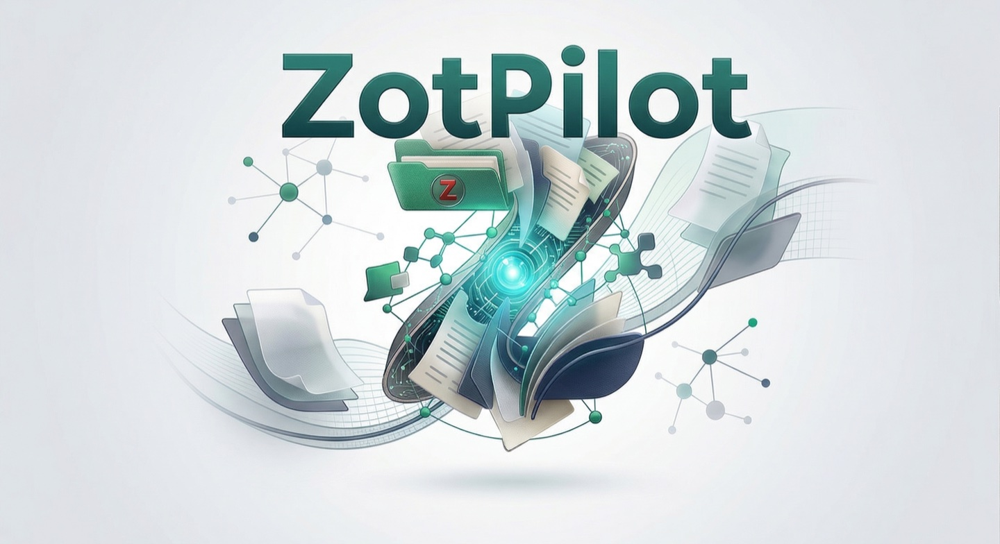

<div align="center">
  <h2>🧭 Your AI Pilot for Zotero</h2>
  

  <p>
    
    
    
  </p>
  <p>
    
    
    
  </p>

  <p>
    <a href="#quick-start">Quick Start</a> &bull;
    <a href="#compared-to-alternatives">Compare</a> &bull;
    <a href="#how-it-works">Architecture</a> &bull;
    <a href="README.md">简体中文</a>
  </p>
</div>

---

## What is this

ZotPilot is an MCP server that adds semantic search, citation graph queries, and AI-assisted organization to your Zotero library. It ships with an Agent Skill for guided setup and usage.

It builds a local vector index over your Zotero data, then exposes 32 tools to AI agents via MCP protocol. The AI can search your papers by meaning (not keywords), locate specific passages within paper sections, look up who cited what, help you tag and sort your collection, and read/write notes and annotations. Your papers stay on your machine. No-RAG mode available — metadata search, notes, tags, and collections work without an embedding API key.

---

## Why this exists

You're writing a Related Work section and you remember reading about "the relationship between sleep spindles and memory consolidation." But you can't find it in Zotero. You remember the concept; Zotero only matches exact words. Searching "memory consolidation during sleep" won't find a paper that says "sleep spindle-dependent replay," even though they describe the same thing.

Beyond search, there are a few other things Zotero can't do:

- "Which papers report N400 effects in their Results section?" — you have to open each PDF and look
- You know a paper has an accuracy comparison table, but you can't search table contents
- "Who cites this paper? What do they say about it?" — manual Google Scholar work
- Tagging and sorting 200 papers by theme — drag-and-drop busywork

---

## What it looks like in practice

**Semantic search:**

> "relationship between sleep spindles and memory consolidation"

Returns 3 papers, even though they use the phrase "spindle-dependent replay." Zotero wouldn't find these.

**Section-level retrieval:**

> "Which papers report N400 effects in their Results?"

Returns passages from Results sections only, with `[Author2022, p.12]` citations. Passing mentions in Introduction or References don't show up. Q1 journal results rank higher.

**Batch organization:**

> "Tag all deep learning papers and move them to a DL Methods collection"

Semantic search matches 28 papers, auto-tags them, creates the collection, syncs back to Zotero. Asks for confirmation if more than 5 papers are affected.

**Citation exploration:**

> "Who cites Wang 2022 and what do they say about the limitations?"

Finds 15 citing papers via OpenAlex, searches them for critique passages.

**Table search:**

> "Find tables comparing model accuracy"

Searches extracted table headers, cell data, and captions from PDFs.

---

## Compared to alternatives

| Approach | Semantic search | Knows paper structure | Organizes for you | Citation graph | Setup time |
|----------|:-:|:-:|:-:|:-:|-------|
| Zotero built-in search | No | No | No | No | None |
| Feed PDFs to AI | Yes | No (section info lost) | No | No | Manual, token-limited |
| Build your own RAG | Yes | Depends on implementation | No | No | Hours |
| ZotPilot | Yes | Yes | Yes | Yes (OpenAlex) | ~5 min |

The difference from DIY RAG: after finding a passage, ZotPilot knows whether it's from Results or Methods, from a Q1 journal or a workshop, and adjusts ranking accordingly. The scoring formula is `similarity^0.7 × section_weight × journal_quality`. Combined with table search, citation graph, and Zotero write operations, it covers most of the literature research workflow.

---

## Quick start

### Option 1: Let your agent install it

Copy this to your AI agent:

> Install the ZotPilot skill for me: clone https://github.com/xunhe730/ZotPilot.git into my skills directory, then help me set up my Zotero library.

The agent clones the repo, installs the CLI, configures Zotero, and registers the MCP server. Restart once, then you're ready.

**Skills directory (clone target):**

| Platform | Target path |
|------|----------|
| Claude Code | `~/.claude/skills/zotpilot` |
| Codex (recommended current path) | `~/.agents/skills/zotpilot` |
| Codex (legacy compatibility path) | `~/.codex/skills/zotpilot` |
| OpenCode | `~/.config/opencode/skills/zotpilot` |
| Gemini CLI | `~/.gemini/skills/zotpilot` |

Current Codex builds prefer `~/.agents/skills` for user-installed skills, while still keeping the old `$CODEX_HOME/skills` location for backward compatibility. When `CODEX_HOME` is unset, that legacy path is usually `~/.codex/skills`.

### Option 2: Manual install

**1. Clone to your skills directory (Tier 1 platforms with Skill support):**

```bash
# Claude Code
git clone https://github.com/xunhe730/ZotPilot.git ~/.claude/skills/zotpilot

# Codex (recommended current path)
git clone https://github.com/xunhe730/ZotPilot.git ~/.agents/skills/zotpilot

# Codex (legacy compatibility path; some desktop environments still surface this folder)
git clone https://github.com/xunhe730/ZotPilot.git ~/.codex/skills/zotpilot

# OpenCode
git clone https://github.com/xunhe730/ZotPilot.git ~/.config/opencode/skills/zotpilot

# Gemini CLI
git clone https://github.com/xunhe730/ZotPilot.git ~/.gemini/skills/zotpilot
```

Windows equivalents:

```powershell
# Codex (recommended current path)
git clone https://github.com/xunhe730/ZotPilot.git $HOME/.agents/skills/zotpilot

# Codex (legacy compatibility path)
git clone https://github.com/xunhe730/ZotPilot.git $HOME/.codex/skills/zotpilot
```

Tier 2 platforms (Cursor, Windsurf, Cline, Roo Code) don't need the skill clone — just install the CLI and register MCP:
```bash
pip install zotpilot  # or: uv tool install zotpilot
```

**2. Register the MCP server:**

Two ways to pass API keys to the MCP server:

**Method A (recommended):** Set environment variables (`export GEMINI_API_KEY=<key>` in shell profile). The server reads them at startup. Keys stay out of shell history and config files. Works for terminal-based clients (Claude Code, Codex, Gemini CLI).

**Method B (compatibility fallback):** Pass keys via CLI flags during registration. `register` writes them into the MCP client config (e.g. `settings.local.json`), which injects them at server startup. Works with all MCP clients, including IDE-based ones (Cursor, Windsurf) that may not inherit shell env vars. Note: keys appear in shell history and plaintext config files.

```bash
# Recommended: set env vars, then register
export GEMINI_API_KEY=<key>
python3 scripts/run.py register          # Tier 1 (source checkout)
zotpilot register                        # Tier 2 (pip/uv install)

# Compatibility fallback: pass keys as CLI flags (IDE clients may need this)
python3 scripts/run.py register --gemini-key <key>    # Tier 1
zotpilot register --gemini-key <key>                  # Tier 2

# Specify platform:
python3 scripts/run.py register --platform claude-code  # or: zotpilot register --platform claude-code
```

Supports: Claude Code, Codex CLI, OpenCode, Gemini CLI, Cursor, Windsurf, Cline, Roo Code.

**3. Restart your AI agent.**

### What happens on first use

When you say "search my Zotero" the first time, the Skill walks through setup:

1. Detects missing `zotpilot` CLI, installs it via `uv tool install`
2. Finds your Zotero data directory, asks which embedding provider to use
3. Registers the MCP server (if not done already)
4. You restart once for MCP tools to load
5. Indexes your papers, ~2-5 seconds each
6. Ready to search after that

**Three embedding options:**

| Provider | API Key | Quality | Offline | Default Dimensions |
|----------|:---:|------|:---:|------|
| Gemini [`gemini-embedding-001`](https://ai.google.dev/gemini-api/docs/embeddings) | Yes ([free tier](https://aistudio.google.com/apikey)) | [MTEB 68.32](https://huggingface.co/spaces/mteb/leaderboard) | No | 768 |
| DashScope [`text-embedding-v4`](https://help.aliyun.com/zh/model-studio/embedding) | Yes ([free tier](https://bailian.console.aliyun.com/)) | [MTEB 68.36 / C-MTEB 70.14](https://huggingface.co/spaces/mteb/leaderboard) | No | 1024 |
| Local [`all-MiniLM-L6-v2`](https://huggingface.co/sentence-transformers/all-MiniLM-L6-v2) | Local (free) | [MTEB ~56](https://huggingface.co/spaces/mteb/leaderboard) | Yes | 384 |

Note: this choice is hard to change later. The three providers produce different vector dimensions, so switching requires `zotpilot index --force` to re-index everything. Pick before you index.

---

## Common commands

| What you say | What happens |
|---|---|
| "Search my papers for X" | Semantic search across all indexed papers |
| "What do I have on X?" | Topic-level survey, papers grouped by relevance |
| "Find the paper by Author about Y" | Exact-match search + paper details |
| "Show me tables comparing X" | Searches extracted table content |
| "Who cites this paper?" | Citation lookup via OpenAlex |
| "Tag these papers as X" | Adds tags via Zotero Web API |
| "Create a collection called X" | Creates a Zotero folder |
| "How many papers are indexed?" | Index status check |

---

## 32 MCP tools

<details>
<summary>Search (7)</summary>

| Tool | What it does |
|------|-------------|
| `search_papers` | Semantic search with section/journal weighting |
| `search_topic` | Topic-level paper discovery, deduplicated by document |
| `search_boolean` | Exact word matching (AND/OR) |
| `advanced_search` | Multi-condition metadata search (year/author/tag/collection etc.), works without indexing |
| `search_tables` | Search table content |
| `search_figures` | Search figure captions |
| `get_passage_context` | Expand a result with surrounding text |

</details>

<details>
<summary>Browse (9)</summary>

| Tool | What it does |
|------|-------------|
| `get_library_overview` | List all papers with index status |
| `get_paper_details` | Full metadata for one paper |
| `list_collections` | All Zotero folders |
| `get_collection_papers` | Papers in a specific folder |
| `list_tags` | All tags |
| `get_index_stats` | Index status: doc count, chunk count |
| `get_notes` | Read and search notes |
| `get_feeds` | List RSS feeds or get feed items |
| `get_annotations` | Read highlights and comments (requires ZOTERO_API_KEY) |

</details>

<details>
<summary>Write (6)</summary>

| Tool | What it does |
|------|-------------|
| `add_item_tags` / `remove_item_tags` | Add/remove tags |
| `set_item_tags` | Replace all tags |
| `add_to_collection` / `remove_from_collection` | Move in/out of folders |
| `create_collection` | Create a folder |
| `create_note` | Add a note to a paper (requires ZOTERO_API_KEY) |

</details>

<details>
<summary>Batch (2)</summary>

| Tool | What it does |
|------|-------------|
| `batch_tags(action="add\|set\|remove")` | Batch tag operations (up to 100 items) |
| `batch_collections(action="add\|remove")` | Batch folder operations (up to 100 items) |

</details>

<details>
<summary>Citations (3)</summary>

| Tool | What it does |
|------|-------------|
| `find_citing_papers` | Who cites this paper (OpenAlex) |
| `find_references` | What this paper cites |
| `get_citation_count` | Citation count |

</details>

<details>
<summary>Admin (5)</summary>

| Tool | What it does |
|------|-------------|
| `index_library` | Index new papers (incremental, supports batching: `batch_size=20`, loop until `has_more=false`) |
| `switch_library` | List/switch libraries (supports group libraries) |
| `get_reranking_config` | View ranking weights |
| `get_vision_costs` | Check vision API usage |

</details>

---

## How it works

ZotPilot's core is an MCP server. [SKILL.md](SKILL.md) provides setup and usage guidance, and [scripts/run.py](scripts/run.py) handles auto-installation and cross-platform registration. Your AI agent loads the skill and launches the MCP server with 32 tools.

```
Indexing (run once)
Zotero SQLite ──→ PDF extraction ──→ Chunking + sections ──→ Embeddings ──→ ChromaDB

Usage (every query)
AI Agent ──→ 32 MCP tools ──┬── Semantic search ──→ ChromaDB ──→ Reranking ──→ Results
                             ├── Citation graph  ──→ OpenAlex
                             ├── Library browse  ──→ Zotero SQLite
                             └── Write ops       ──→ Zotero Web API ──→ Syncs to Zotero
```

**Indexing:** reads metadata from Zotero SQLite (read-only), extracts full text, tables, and figures from PDFs via PyMuPDF, classifies chunks by academic section (Abstract / Methods / Results / …), generates embeddings, stores in ChromaDB.

**Retrieval:** query is vectorized, cosine similarity search in ChromaDB, results go through section-aware reranking (Results weighted higher than References) and journal quality weighting (SCImago Q1 papers rank higher).

**Write operations:** tag and collection management via Zotero's official Web API (Pyzotero), changes sync back to Zotero automatically.

**Citation graph:** forward and backward citation lookup via OpenAlex API.

Design choices:

- Zotero SQLite is opened with `mode=ro&immutable=1`. Read-only. Safe while Zotero is running.
- Paper data stays local. The only network requests are embedding API calls (zero if using Local model).
- Documents and queries use different encodings (Gemini's `RETRIEVAL_DOCUMENT` / `RETRIEVAL_QUERY`), which improves retrieval quality over using the same encoding for both.
- SKILL.md doesn't just expose tool interfaces; it tells the AI which tool to use in which scenario and how to combine them.

### File structure

```
~/.claude/skills/zotpilot/          # or ~/.agents/skills/zotpilot/ (Codex primary path)
~/.codex/skills/zotpilot/           # Codex legacy compatibility path
├── SKILL.md                        # Decision tree: setup → index → research
├── scripts/run.py                  # Bootstrap: auto-installs CLI + delegates
├── references/                     # Reference docs
│   ├── tool-guide.md               # Tool parameter details
│   ├── troubleshooting.md          # Common issues
│   └── install-steps.md            # Manual install reference
└── src/zotpilot/                   # MCP server source
```

### Data storage

```
~/.config/zotpilot/config.json      # Configuration (Zotero path, embedding provider)
~/.local/share/zotpilot/chroma/     # Vector index
```

---

## Enable write operations

Search and citation tools work without extra setup. Tagging and collection management need a Zotero Web API key.

1. Go to [zotero.org/settings/keys](https://www.zotero.org/settings/keys), create a key with "Allow library access" and "Allow write access" checked
2. Note your User ID (the number on the page, not your username)


3. Tell your agent:

> Enable ZotPilot write operations. My Zotero API Key is `xxxxx` and my User ID is `12345`.

<details>
<summary>Manual configuration</summary>

```bash
# Tier 1 (source checkout) — include ALL existing keys when re-registering:
python3 scripts/run.py register --gemini-key <your-gemini-key> --zotero-api-key <your-zotero-key> --zotero-user-id <your-user-id>
# Tier 2 (pip/uv install):
zotpilot register --gemini-key <your-gemini-key> --zotero-api-key <your-zotero-key> --zotero-user-id <your-user-id>
```

> **Note:** `register` replaces the entire ZotPilot MCP entry. If you previously registered with `--gemini-key`, include it again or it will be removed from the config.

Auto-detects platform and re-registers (removes stale entry first). Supports all platforms. Restart your agent.

</details>

Without these credentials, search and citations still work. Only tag and collection management requires the key.

---

## FAQ

<details>
<summary>Does this modify my Zotero database?</summary>

No. SQLite is opened with `mode=ro&immutable=1`, physically read-only. Tag and collection changes go through Zotero's official Web API v3 and sync back to the Zotero client normally.

</details>

<details>
<summary>Safe to run while Zotero is open?</summary>

Yes, read-only mode doesn't conflict.

</details>

<details>
<summary>Which agents are supported?</summary>

**Tier 1 (Skill + MCP):** Claude Code, Codex CLI, OpenCode, Gemini CLI — full support with Skill-guided workflows + MCP tools.

**Tier 2 (MCP only):** Cursor, Windsurf, Cline, Roo Code — MCP tools available, no Skill guidance.

Any AI agent that supports MCP protocol can connect to ZotPilot's search and management tools.

</details>

<details>
<summary>Does Gemini embedding cost money?</summary>

Free tier is about 1,000 requests/day. One 10-page paper uses about 1 request (32 text chunks per request), and each search query uses 1 request. Free tier is enough to index a few hundred papers. Beyond that, $0.15/million tokens. Local model costs nothing.

</details>

<details>
<summary>What about DashScope/Bailian?</summary>

Alibaba Cloud's `text-embedding-v4`, 1024 dimensions, MTEB 68.36 / C-MTEB 70.14. No VPN needed in China, ¥0.0005/1k tokens, 1M tokens free for new users. Use `--provider dashscope` during setup. Key at https://bailian.console.aliyun.com/.

</details>

<details>
<summary>Local embedding model?</summary>

`all-MiniLM-L6-v2`, about 80MB, auto-downloaded on first use. Fully offline after that. Lower quality than Gemini (384d vs 768d) but works fine for libraries under a few hundred papers.

</details>

<details>
<summary>How long does indexing take? Disk space?</summary>

2-5 seconds per paper, 300 papers takes about 15 minutes. Index size is roughly 1MB per 100 papers. `--limit 10` to test. Already-indexed papers are skipped.

</details>

<details>
<summary>Scanned PDFs / figures / long documents?</summary>

- Scanned PDFs: automatic OCR fallback — when PyMuPDF extracts too little text, retries with Tesseract full-page OCR. Install Tesseract: macOS `brew install tesseract tesseract-lang`, Ubuntu/Debian `sudo apt install tesseract-ocr`, Windows from [UB Mannheim](https://github.com/UB-Mannheim/tesseract/wiki)
- Figures: captions and surrounding text are indexed, not the image itself. PNG files saved locally
- Long documents: skipped above 40 pages by default (`--max-pages` to adjust), `--item-key` to index specific ones
- Batch indexing: MCP defaults to 20 items per call (`batch_size=20`), agent loops until `has_more=false`. CLI processes all at once by default
- Table repair: optional, uses Claude Haiku to fix complex tables, requires `ANTHROPIC_API_KEY`

</details>

<details>
<summary>Can I use this with no API key at all?</summary>

Yes. Choose `--provider local` and everything runs offline.

</details>

<details>
<summary>What about vision table extraction?</summary>

Optional feature. Uses Claude Haiku (via Batch API) to re-extract PDF tables, fixing merged cells and multi-level headers that PyMuPDF sometimes garbles. Requires `ANTHROPIC_API_KEY`. Without it, the feature is silently skipped; text search still works. Costs are logged in `vision_costs.json`.

</details>

<details>
<summary>Where does citation data come from? Chinese papers?</summary>

[OpenAlex](https://openalex.org/), covering about 250 million works. DOI-based lookup. Chinese papers with DOIs that OpenAlex indexes work fine. Papers without DOIs can't use citation tools, but semantic search and tag management don't need DOIs.

</details>

---

## Troubleshooting

| Problem | Fix |
|---------|-----|
| Skill not found | Verify clone target: Claude Code `~/.claude/skills/`, Codex `~/.agents/skills/` (legacy compatibility path: `~/.codex/skills/`), OpenCode `~/.config/opencode/skills/`, Gemini `~/.gemini/skills/` |
| `zotpilot: command not found` | `python3 scripts/run.py status` (auto-installs) |
| MCP tools not showing up | Re-register MCP server and restart |
| Empty search results | Run `zotpilot index` first, or try a broader query |
| `GEMINI_API_KEY not set` | Set the env var, or `zotpilot setup --non-interactive --provider local` |
| Not sure what's wrong | Run `zotpilot doctor` |

More at [references/troubleshooting.md](references/troubleshooting.md).

---

<details>
<summary>Development / Contributing</summary>

```bash
git clone https://github.com/xunhe730/ZotPilot.git
cd ZotPilot
uv sync --extra dev
uv run pytest              # 131 tests
uv run ruff check src/
```

Contributions welcome. See [CONTRIBUTING.md](CONTRIBUTING.md).

</details>

---

<div align="center">
  <p>
    <a href="https://github.com/xunhe730/ZotPilot/issues">Report a bug</a> &middot;
    <a href="https://github.com/xunhe730/ZotPilot/issues">Request a feature</a> &middot;
    <a href="https://github.com/xunhe730/ZotPilot/discussions">Discussions</a>
  </p>
  <sub>MIT License &copy; 2026 xunhe</sub>
</div>
